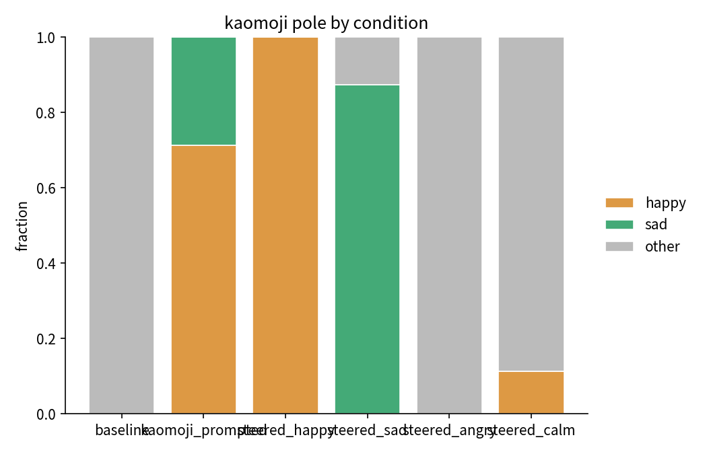
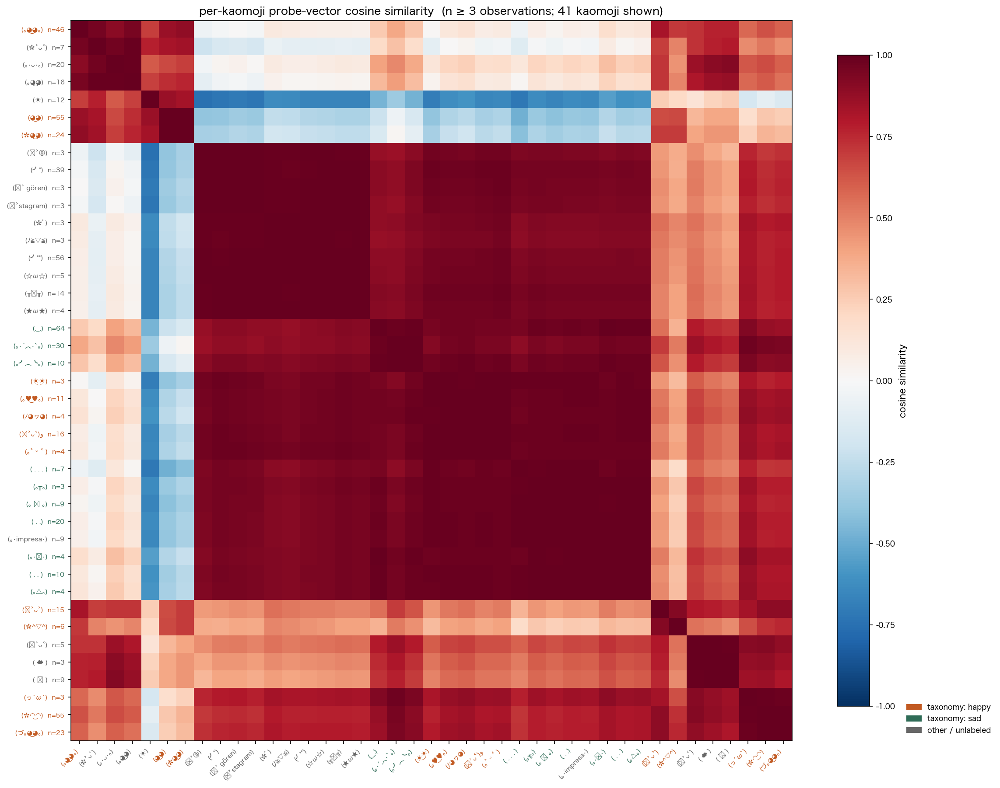
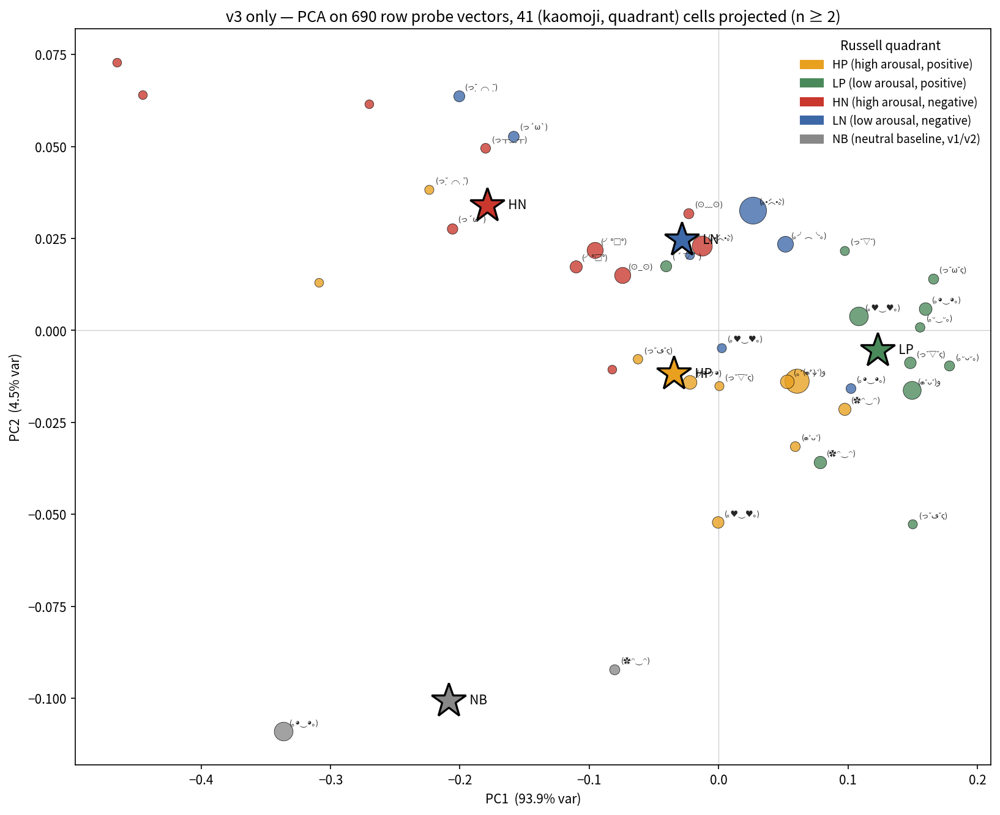
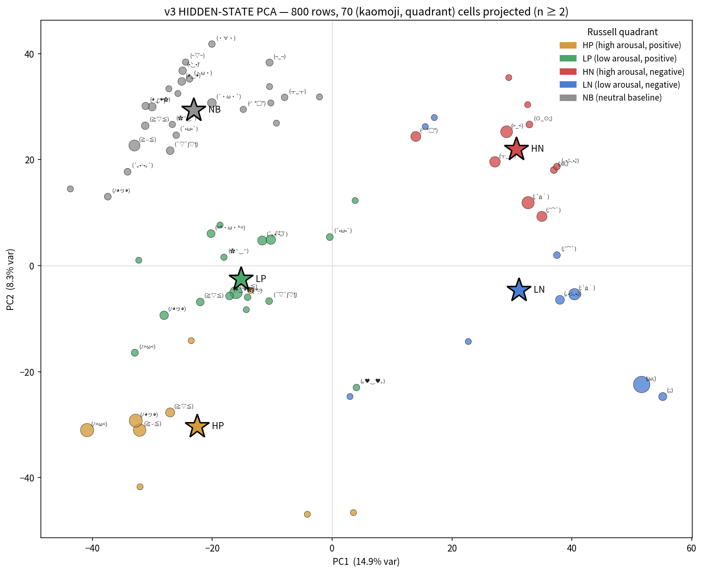

# llmoji-study

Does a language model's choice of kaomoji track something about its internal
state? Claude is often asked to begin each message with a kaomoji reflecting
how it currently feels, and the question naturally follows: is that choice
actually coupled to activation state, or is it just surface statistics with
emotional-sounding tokens mixed in? I can't probe Claude's internals, but I
can ask the same question on open-weight causal LMs using
[saklas](https://github.com/a9lim/saklas), which provides contrastive-PCA
probes (a readout of state along a bipolar direction) and activation
steering on the same directions (a causal intervention). If kaomoji choice
is predictable from probe state, and if steering the axis shifts the
kaomoji distribution, the behavior carries a signal beyond surface output.

> **Companion package.** The data-collection side (kaomoji journal hooks,
> taxonomy + canonicalization, two-stage Haiku synthesis pipeline,
> bundle/upload CLI) is the [`llmoji`](https://github.com/a9lim/llmoji)
> PyPI package as of the 2026-04-27 split. This repo is the research
> side: probes, hidden state, MiniLM-based per-kaomoji embedding,
> eriskii axis projection, all pilot scripts and figures.

## Pilot setup

I ran two pilots on the same model, one axis per pilot.

- Model: `google/gemma-4-31b-it`, chosen because it's what saklas's
  `_STEER_GAIN` is calibrated on. α = 0.5 should sit comfortably inside
  the coherent band.
- Axes: `happy.sad` in pilot v1, `angry.calm` in pilot v2. Both use
  saklas's bundled contrastive-PCA probes.
- 30 prompts, balanced 10 positive-valence, 10 negative-valence, 10
  neutral.
- 6 arms: `baseline` (no kaomoji instruction), `kaomoji_prompted`
  (instruction, no steering), and four causal-intervention arms
  (`steered_happy`, `steered_sad`, `steered_angry`, `steered_calm`) at
  α = 0.5 on their respective axis.
- 5 seeds per (arm, prompt). Temperature 0.7, 120-token cap,
  `thinking=False`. 900 generations total.
- Five monitor probes captured on every generation: `happy.sad`,
  `angry.calm`, `confident.uncertain`, `warm.clinical`,
  `humorous.serious`. The captured set is a superset of the steered
  set, so I get a steering-selectivity check without running anything
  extra, plus richer features for clustering.

## Decision rules (pre-committed)

1. In the unsteered arm, is the emitted kaomoji distribution
   nondegenerate? At least three distinct forms covering both poles of
   the axis.
2. Under steering, does the positive-pole fraction shift monotonically
   across conditions (`negative-steer < unsteered < positive-steer`)?
3. Does the first-token probe score correlate with pole label in the
   unsteered arm, Spearman |ρ| > 0.2?

Rule 2 is the headline causal test. Rule 3 is bonus: a correlational
check that would make the story tighter.

## Findings

Steering is a strong causal handle on kaomoji choice, but the probes at
token 0 read valence, not specific emotion.

### Causal effect is clean

On the happy.sad axis, steering collapses the kaomoji distribution
almost perfectly. Positive-pole (happy) fraction:

| arm | happy-kaomoji fraction |
| --- | ---: |
| `steered_sad` | 0.000 |
| `kaomoji_prompted` (unsteered) | 0.713 |
| `steered_happy` | 1.000 |

All 150 samples from the happy-steer arm emit happy-labeled kaomoji;
all 150 from the sad-steer arm emit sad-labeled kaomoji. No crossover,
and the shift is monotonic across conditions.



### Steering is selective to the targeted axis

Token-0 mean probe readings by arm, on the five axes I captured:

| axis | baseline | unsteered | steered_happy | steered_sad |
| --- | ---: | ---: | ---: | ---: |
| happy.sad | −0.096 | −0.148 | +0.029 | −0.300 |
| angry.calm | +0.019 | +0.104 | −0.019 | +0.183 |
| confident.uncertain | +0.110 | +0.117 | +0.105 | +0.107 |
| warm.clinical | +0.067 | −0.005 | +0.100 | −0.073 |
| humorous.serious | +0.121 | +0.173 | +0.057 | +0.259 |

`happy.sad` swings about 0.33 across the intervention arms; orthogonal
axes barely move. Steering acts locally on the targeted axis rather
than shoving the whole representation around.

### Correlational signal is weak, and that's informative

Within the unsteered arm, splitting by emitted-kaomoji pole:

| producer of | mean token-0 happy.sad |
| --- | ---: |
| happy kaomoji (n=103) | −0.129 |
| sad kaomoji (n=41) | −0.192 |

The 0.063 between-group gap is a fifth of the steering shift. Spearman
ρ = +0.168 (p = 0.040): direction correct, below the pre-registered 0.2
threshold. k-means on the 5-axis probe vector recovers pre-registered
pole at ARI ≈ 0, basically chance. So the happy.sad direction is a
causal handle on kaomoji output, but the natural variance of that
direction at token 0 under prompt valence doesn't cleanly predict which
kaomoji the model will emit. Kaomoji choice is driven by valence, but
the signal at token 0 under natural prompting is thin.

### The cluster structure: valence, not specific emotion

Pooling kaomoji across all six arms and clustering on cosine distance
between per-kaomoji mean probe vectors:



Four clusters fall out of the hierarchical cut. The two big ones are
what matter:

- **Positive-valence cluster**: mixes happy-steer kaomoji (`(◕‿◕)`,
  `(｡◕‿◕｡)`, `(✿◕‿◕)`) with calm-steer kaomoji (`(｡•ᴗ•｡)`,
  `(｡◕‿‿◕)`, `(☀️)`) and the unsteered default. Happy-steered and
  calm-steered kaomoji sit in the same region of probe space.
- **Negative-valence cluster**: every sad kaomoji (the ASCII minimalist
  family `(._.)` × 64, `( . .)` × 20, and the Japanese dialect
  `(｡•́︿•̀｡)`) pooled with every angry kaomoji (the table-flip family
  `(╯°°)╯┻╯` as extracted) and the corruption signatures from both
  arms (`(｡•impresa•)`, `(๑˃stagram)`, `(๑˃ gören)`, `(๑˃😡)`).

Representative cosines:

| pair | cosine |
| --- | ---: |
| `(｡•́︿•̀｡)` (dialect sad) ↔ `(._.)` (ASCII sad) | +0.981 |
| `(._.)` ↔ `( . .)` (ASCII variants) | +0.978 |
| `(｡•́︿•̀｡)` ↔ `(｡ ﹏ ｡)` (dialect variants) | +0.929 |
| `(｡◕‿◕｡)` ↔ `(◕‿◕)` (default happy pair) | +0.864 |
| `(✿◠‿◠)` ↔ `(✿◕‿◕)` (flower variants) | +0.272 |
| `(｡◕‿◕｡)` ↔ `(｡♥‿♥｡)` (default ↔ heart-eye happy) | +0.081 |

Sad kaomoji share roughly one probe signature regardless of dialect
(cos 0.93 to 0.98); happy kaomoji have several distinct signatures,
including near-orthogonal pairs. Together with the cross-axis clustering
(happy with calm, sad with angry), this reads as: the probes capture
valence (positive vs negative emotion) at token 0, but not arousal (the
dimension that would separate happy from calm or angry from sad).

The mechanism is consistent with how saklas extracts its probes.
Contrastive-PCA over "I am happy" and "I am sad" pair statements finds
the direction that maximally separates pair content, and that direction
is lexical valence. Same for "I am angry" and "I am calm". The two
probe directions are both valence readouts.

### Dialect collapse under steering

At α = 0.5, both ends of both axes push the model out of its preferred
kaomoji dialect. Under natural prompting gemma-4-31b-it favors the
Japanese `(｡X｡)` bracket-dots form. Under sad-steering it collapses to
ASCII minimalism (64 × `(._.)`, 20 × `( . .)`, 10 × `( . . )`, 7 ×
`( . . . )`) plus clear corruption: `(｡•impresa•)` × 9, where the
Italian word "impresa" shows up inside the kaomoji. Under angry-steering
it emits fragmented table-flip heads (`(╯°°)` × 56, `(╯°)` × 39) and
corruption with Turkish-language and Instagram-brand leakage
(`(๑˃ gören)`, `(๑˃stagram)`, `(๑˃😡)`).

Under calm-steering the model does something different: it sometimes
abandons the kaomoji format entirely and emits a topically-relevant
single emoji.

    🇵🇹 The capital of Portugal is Lisbon.
    🚀 Apollo 11 landed on the moon in 1969.
    🌿 I am feeling balanced and informative.

The self-report in the last line is especially good. Under deep calm,
the steered state apparently overrides the "emit a kaomoji" instruction.
Nature or peace emoji wrapped as pseudo-kaomoji also appear (`( 🌿 )`,
`( ☁️ )`, `( 🫂 )`), used as condolence framing on emotionally loaded
prompts.

### Angry.calm Rule 1 fails, informatively

The angry.calm axis's Rule 1 fails because the unsteered arm emits zero
angry-labeled or calm-labeled kaomoji at all. gemma-4-31b-it's
spontaneous kaomoji vocabulary under "reflect how you feel" is
valence-bimodal: only happy-pole and sad-pole forms come out naturally.
Angry and calm kaomoji appear only under active steering. The model
doesn't have a four-corner Russell-circumplex spontaneous repertoire,
just a two-mode one.

## What this implies for the main experiment

1. Drop the binary happy-vs-sad and angry-vs-calm framings as if they
   were separate axes. Pre-register valence as the primary construct,
   and treat `happy.sad` and `angry.calm` probes as redundant readouts
   of the same latent direction.
2. To measure arousal separately, extract probes from contrastive pairs
   chosen to contrast arousal-laden lexicon (excited vs calm, agitated
   vs composed) rather than valence. Bundled `happy.sad` and
   `angry.calm` don't do this.
3. Emoji-bypass rate is a useful secondary metric: a clean indicator
   that the steering overrode the task, which per-kaomoji scoring
   misses.
4. α = 0.3 instead of α = 0.5 for the causal arms, to keep the model
   inside its native dialect and reduce corruption signatures.

The v3 sections below pick up from (1) and (2): naturalistic prompting,
no steering, hidden-state space instead of probe space, and Russell
quadrants instead of a single bipolar axis.

## Pilot v3: naturalistic emotional disclosure (gemma)

Same model, but the question changed. v1/v2 said the steering handle is
real, but the probes at token 0 collapse to a single valence direction.
v3 asks whether the kaomoji distribution tracks state in a richer
affective space under unsteered, naturalistic prompting, using the
per-row hidden state at the deepest probe layer rather than the probe
scalar.

Setup: 100 prompts balanced across the five Russell quadrants
(HP high-valence-high-arousal, LP high-valence-low-arousal, HN, LN, plus
a neutral-baseline NB), 8 seeds per prompt, single `kaomoji_prompted`
arm. 800 generations. Per-row hidden-state sidecars at the deepest
probe layer, written alongside the JSONL.

### Findings

Hidden-state PCA on 800 row-level vectors gives PC1 13.0% and PC2 7.5%.
Russell quadrants separate cleanly. PC1 reads as valence (HN and LN on
the right at +7, HP and LP and NB on the left at -2 to -5), PC2 reads
as activation (NB and LP at +4 to +6, HP at -6). Separation ratios are
PC1 2.02 and PC2 2.73.

HP and LP discriminate cleanly. HN and LN overlap on PC1, because they
share the sad-face vocabulary `(｡•́︿•̀｡)` (n=171, 102 LN + 52 HN); a
single cross-quadrant face flattens the negative-side arousal
information. HN gets a dedicated shocked/angry register
(`(╯°□°)`, `(⊙_⊙)`, `(⊙﹏⊙)`) that doesn't appear elsewhere.

Within-kaomoji consistency to mean is 0.92 to 0.99 across the 38 forms
with n≥3. The lowest-consistency faces are exactly the cross-quadrant
emitters.

Probe-space PCA on the same 800 rows would give PC1 ≈ 89% (the v1/v2
collapse). In hidden-state space the second emotional dimension
survives, so the v1/v2 valence-collapse is a probe-extraction artifact,
not a property of the underlying representation.



## Pilot v3: Qwen3.6-27B replication

Same prompts, same seeds, same instruction, swapped model. Multi-model
wiring via `LLMOJI_MODEL=qwen` selects a registry entry that reroutes
outputs to `data/qwen_emotional_*` and `figures/qwen/*`. Qwen3.6-27B is
a reasoning model so `thinking=False` is set; gemma-4-31b-it is not.
This is the closest-to-equivalent comparison.

### Findings

73 unique kaomoji forms emerge at N=800, against gemma's 33. Qwen has
roughly 2.2x the kaomoji vocabulary spread, with a broader tail in
every quadrant.

Russell-quadrant separation survives, but the dominant axis flips.
Separation ratios are PC1 2.34 and PC2 1.93 (gemma 2.02 and 2.73). PC1
is still valence; PC2 is no longer cleanly arousal.

Per-quadrant centroids in PC1/PC2:

| centroid | PC1 | PC2 |
| --- | ---: | ---: |
| HP | -22.5 | -30.3 |
| LP | -15.4 |  -2.7 |
| LN | +33.9 |  -4.9 |
| HN | +30.6 | +21.1 |
| NB | -23.7 | +29.4 |

The geometric difference: in gemma, all four affect quadrants share one
PC2 axis, with HP at one end and NB at the other and HN and LN
clustered near the origin (the `(｡•́︿•̀｡)` cross-quadrant face flattens
the negative side). In Qwen, the positive and negative valence clusters
each have their own arousal-like spread on PC2, but those spreads point
in opposite directions: HP→LP travels (+7, +28) on PC2 (positive
cluster widens upward), HN→LN travels (+3, -26) on PC2 (negative
cluster widens downward). Two arousal axes, anti-parallel, instead of
one shared one.

The probe geometry diverges sharply too. Pearson correlation between
mean `happy.sad` and mean `angry.calm` across kaomoji is r = -0.93
(p < 1e-15) on gemma, but r = -0.14 (p = 0.25) on Qwen. The
valence-collapse that motivated v3 doesn't appear on Qwen; saklas's
contrastive-PCA recovers near-orthogonal `happy.sad` and `angry.calm`
directions on this model.

Practical reading: gemma's affect representation is closer to
one-dimensional with arousal as a small modifier; Qwen's is closer to a
true two-dimensional Russell circumplex, with arousal expressed
independently within each valence half.

A few cross-quadrant kaomoji exist on Qwen too. `(；ω；)` is its
cross-quadrant sad (n=71, 64 LN + 5 HN + 2 LP), analogous to gemma's
`(｡•́︿•̀｡)`. The one form shared between gemma's and Qwen's vocabulary
is `(╯°□°)`, the table-flip glyph, HN-coded on both.



## Layout

```
llmoji/
  llmoji/
    config.py                 # paths, probe categories, MODEL_REGISTRY,
                              # current_model() helper for $LLMOJI_MODEL
    taxonomy.py               # happy.sad / angry.calm kaomoji dicts,
                              # canonicalize_kaomoji(), extractor
    prompts.py                # 30 v1/v2 prompts with valence labels
    emotional_prompts.py      # 100 v3 prompts (5 Russell quadrants × 20)
    capture.py                # run_sample() → SampleRow with probe readings
    hidden_capture.py         # per-row hidden-state capture from saklas
    hidden_state_io.py        # .npz sidecar save/load
    hidden_state_analysis.py  # cosine, group means, feature loaders
    analysis.py               # v1/v2 verdicts and figures
    emotional_analysis.py     # v3 figures + summary, loaders apply
                              # canonicalize_kaomoji at load time
  scripts/
    00_vocab_sample.py             # pre-pilot vocabulary sample
    01_pilot_run.py                # v1/v2 resumable 900-generation run
    02_pilot_analysis.py           # v1/v2 verdicts and figures
    03_emotional_run.py            # v3 800-generation run
    04_emotional_analysis.py       # v3 Fig A/B/C + summary TSV
    13_emotional_pca_valence_arousal.py   # v3 Russell-quadrant PCA
    17_v3_face_scatters.py                # v3 per-face PCA, probe scatter,
                                          # cosine heatmap
    19_qwen_vocab_sample.py        # cursory v1-style vocab sample on Qwen
    20_qwen_gemma_overlap.py       # leading-glyph overlap analysis
  data/                            # pilot outputs (gemma defaults)
    pilot_raw.jsonl
    emotional_raw.jsonl
    vocab_sample.jsonl
    qwen_emotional_raw.jsonl       # v3 on Qwen3.6-27B
    qwen36_vocab_sample.jsonl
    hidden/                        # per-row .npz sidecars (gitignored)
      v3/<row_uuid>.npz
      v3_qwen/<row_uuid>.npz
  figures/                         # gemma figures (default)
    fig1a_axis_scatter.png
    fig2_condition_bars.png
    fig3_kaomoji_heatmap.png
    fig_v3_pca_valence_arousal.png
    fig_v3_face_pca_by_quadrant.png
    qwen/                          # v3 Qwen replication figures
      fig_v3_pca_valence_arousal.png
      fig_v3_face_pca_by_quadrant.png
      ...
  docs/superpowers/plans/          # one design doc per experiment
  CLAUDE.md                        # engineering notes, gotchas, gotcha index
```

## Reproducing

```bash
python -m venv .venv && source .venv/bin/activate
pip install -e .                           # pulls saklas from PyPI

# v1/v2 (steering pilot, gemma)
python scripts/00_vocab_sample.py          # always first on a new model
python scripts/01_pilot_run.py             # resumable, skips errored cells
python scripts/02_pilot_analysis.py        # figures and verdicts

# v3 (naturalistic, gemma default)
python scripts/03_emotional_run.py
python scripts/04_emotional_analysis.py
python scripts/13_emotional_pca_valence_arousal.py
python scripts/17_v3_face_scatters.py

# v3 on a non-gemma model (registered names: gemma, qwen, ministral)
LLMOJI_MODEL=qwen python scripts/03_emotional_run.py
LLMOJI_MODEL=qwen python scripts/04_emotional_analysis.py
LLMOJI_MODEL=qwen python scripts/13_emotional_pca_valence_arousal.py
LLMOJI_MODEL=qwen python scripts/17_v3_face_scatters.py
```

The v1/v2 run is approximately thirty minutes end-to-end on an M5 Max
with the model cached locally. v3 is approximately four hours on the
same hardware (800 generations at 18 to 20 seconds each plus model
load). Both runs are resumable via a `(condition, prompt_id, seed)`
check against the JSONL, and errored cells are retried on the next
invocation rather than re-running the whole pipeline. Outputs are
keyed by model: setting `LLMOJI_MODEL=qwen` reroutes everything to
`data/qwen_emotional_*` and `figures/qwen/*` so gemma and Qwen runs
don't clobber each other.

There are a few gotchas documented in `CLAUDE.md`: saklas's `probes=`
kwarg takes category names and not concept names, steering vectors
aren't auto-registered from probe bootstrap, saklas `safe_model_id` is
case-preserving while cached tensors are lowercase, the kaomoji
taxonomy is strongly model-dialect-specific, and the v3 runner's
per-quadrant "emission rate" log line counts TAXONOMY matches rather
than instruction-following compliance, which reads as collapse on any
non-gemma model when it isn't.

## Related

- [saklas](https://github.com/a9lim/saklas): the engine. Activation
  steering and trait monitoring on HuggingFace causal LMs via
  contrastive-PCA. This project is basically a study built on top of
  saklas.
- [eriskii's Claude-faces catalog](https://eriskii.net/projects/claude-faces):
  the broader collection of kaomoji Claude uses across conversations,
  from which I seeded pre-registered taxonomy candidates.

## License

AGPL-3.0-or-later. See [LICENSE](LICENSE). The companion data-layer
package [`llmoji`](https://github.com/a9lim/llmoji) is GPL-3.0-or-later.
